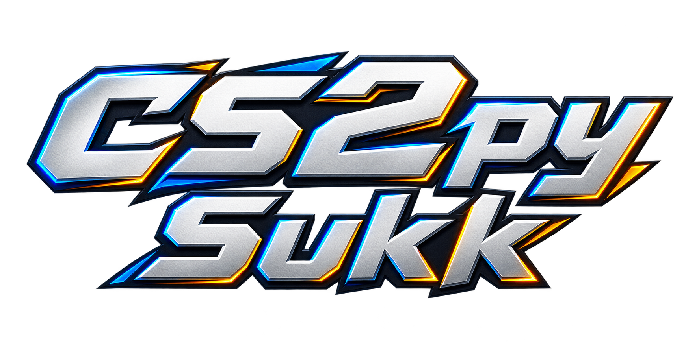

<p align="center"></p>

# CS2py Sukk

Official launcher downloads and setup instructions. A valid license is required to activate the client.

[Download the latest official launcher](https://github.com/sukkaphat1/CS2pySukk-Downloads/releases/latest/download/CS2py.exe)

## Getting started

1. Obtain a Monthly license directly from the owner through Discord.
2. Download **CS2py.exe** from the official release link above.
3. Run it from your normal Windows account. Enter your key in the masked launcher field on the first launch and complete the official Steam sign-in if requested. On later launches, leave the field blank to use the protected key saved in Windows Credential Manager.
4. Start CS2 and run the launcher to open the client.

The native Windows launcher shows its own version separately from the installed client version, and displays verification and update progress without a command-line bootstrap window. It verifies your license on every launch, remembers a successfully activated key using Windows Credential Manager, checks for the latest private release, verifies its signature and files, and installs missing Python dependencies automatically. The client itself opens a visible terminal for its startup banner and diagnostic messages. Git and a GitHub account are not required.

The client installs under `Documents\CS2pySukk`. Settings are carried forward during updates. Close the existing client before updating.

## Renewal and support

Monthly access is purchased one month at a time directly from the owner; there is no automatic billing through this repository. After your key expires, obtain a replacement or renewal from the owner. An expired remembered key allows you to enter a replacement.

To deliberately enter a different key, open PowerShell in the launcher folder and run:

```powershell
.\CS2py.exe --new-key
```

Licenses are bound to a Windows device and a verified Steam account. Contact the owner for a device or Steam-link reset. Never post a license key, payment information, or account credentials in a public issue.

If verification or download fails, the launcher keeps the error visible. Send the owner the message, without including your key. A connection failure is not a confirmed billing failure.

## Client features

- Weapon and knife customization, with optional skin sharing.
- Live match dashboard with private viewing links, player-follow controls, map rotation and zoom.
- Team cards with inventory icons, health, armor, money and scores; round and planted-bomb timers.
- Updated menu layout and mouse-wheel skin browsing. Gloves remain disabled.

This repository contains distribution information and launcher assets only. Development source and internal testing tools are maintained separately.

## Safety and compatibility

Only download the launcher from this repository. Release assets include a SHA-256 checksum for integrity checks. The software is provided as-is, may conflict with game or anti-cheat rules, and does not claim to bypass detection. Use it only where you have permission and accept the risk to your account.

The original project attribution and MIT license are preserved in [LICENSE](LICENSE).
